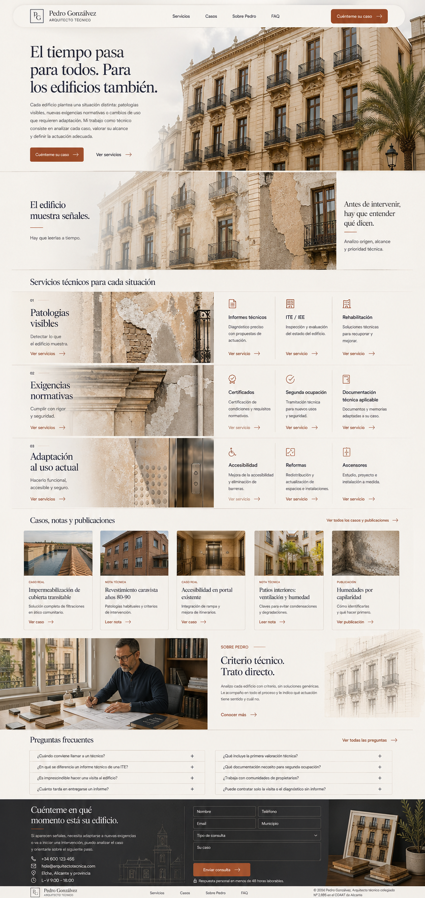
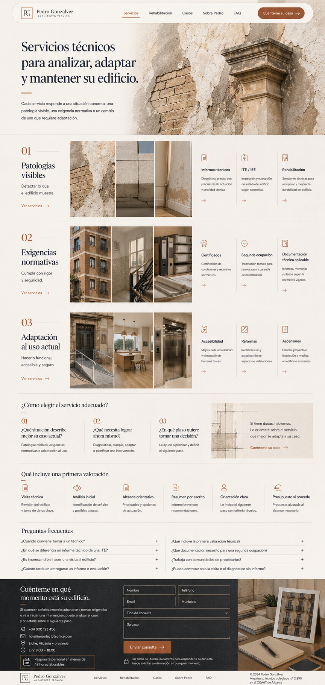
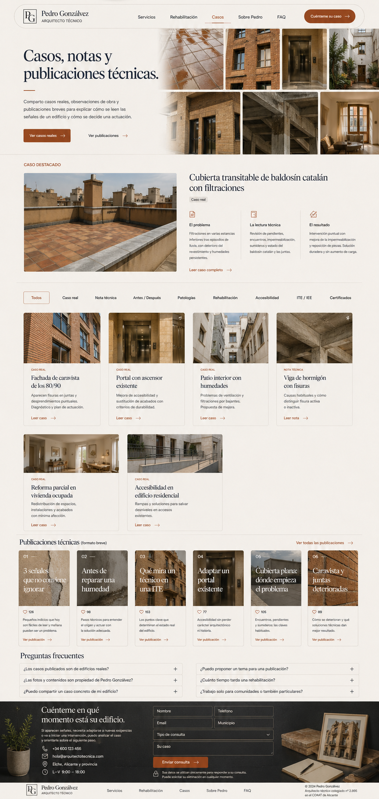
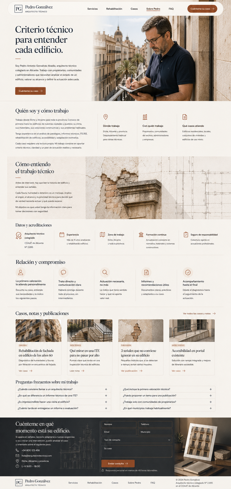
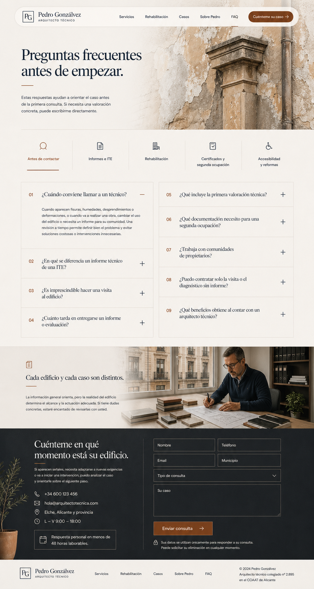

# Propuestas visuales V3.2 — Pedro Gonzálvez

**Fecha:** 2026-04-29  
**Objetivo:** corregir la V3.1 volviendo a la dirección de `18-landing-editorial-mediterraneo.png`, `17-landing-narrativa-completa-v1.png` y `19-landing-scroll-cinematico.png`.

---

## Principios De Esta Versión

- La landing vuelve a una línea editorial mediterránea, no a una plantilla de sistema.
- El header es una barra/pastilla integrada con logo dentro, inspirada en la referencia `19`.
- La animación inicial se entiende como parallax / CSS keyframes: capas, cambios de imagen y cambios de texto en áreas fijas.
- No hay barras, railes ni indicadores visibles de progreso.
- FAQ y contacto tienen aire suficiente; no se comprimen artificialmente.
- Servicios mantiene la lógica de tres situaciones, pero con una representación más visual y moderna.
- Casos/publicaciones muestran más variedad local: baldosín catalán, caravista 80-90, cubierta, portal, patio, interior, accesibilidad.
- Rehabilitación entra dentro de servicios; no se genera como página independiente en esta tanda.

---

> **Nota de orden (2026-04-30):** las imágenes 02-05 están numeradas en el orden en que se generaron, no en el orden definitivo de bloques de la home. El orden vigente está en `06-implementation-notes/implementation-roadmap.md`. En particular, la imagen 04 (Sobre Pedro) representa la página `/sobre-pedro`, no la posición de ese bloque dentro de la home —en la home aparece un resumen corto antes de Servicios (bloque 3), no la versión extendida—.

## Imágenes V3.2

### 01 — Landing Home

**Archivo:** `images/01-v3-2-landing-home.png`  
**Qué mirar:** recuperación del estilo editorial, animación inicial implícita con parallax/keyframes, sin barras visibles, header integrado.

### 02 — Servicios

**Archivo:** `images/02-v3-2-servicios.png`  
**Qué mirar:** bloque de tres rutas más visual y moderno, sin legalizaciones como servicio principal.

### 03 — Casos Y Publicaciones

**Archivo:** `images/03-v3-2-casos-publicaciones.png`  
**Qué mirar:** mezcla de casos/blog y publicaciones tipo Instagram con variedad real de materiales y edificios.

### 04 — Sobre Pedro

**Archivo:** `images/04-v3-2-sobre-pedro.png`  
**Qué mirar:** Pedro visible trabajando, tono humano y experto.

### 05 — FAQ Y Contacto

**Archivo:** `images/05-v3-2-faq-contacto.png`  
**Qué mirar:** FAQ y contacto con más aire, sin compactación forzada.

---

## Regla Para La Animación De Landing

La animación no debe mostrarse con barras visibles. Debe resolverse con:

- parallax de capas de fachada,
- cambio de estado de imagen en el mismo contenedor,
- textos que cambian o entran en zonas fijas,
- zoom suave hacia una señal,
- transición de señal a diagnóstico,
- keyframes CSS o scroll-linked animation cuando sea viable.

Estados narrativos:

1. Edificio en estado inicial.
2. El tiempo actúa sobre el edificio.
3. Aparecen señales.
4. Se hace zoom a una zona.
5. Se interpreta técnicamente.

---

## Regla Para Imágenes

La home puede usar un edificio protagonista estable.  
El resto de páginas y casos deben variar:

- cubierta transitable de baldosín catalán,
- ladrillo caravista años 80-90,
- portal comunitario,
- patio interior,
- cubierta plana,
- vivienda usada,
- detalle de humedad,
- estructura/hormigón,
- acceso con barrera arquitectónica.

---

## Decisión Recomendada

Si esta V3.2 encaja, el siguiente paso ya no debería ser generar más variaciones generales. Lo siguiente sería:

1. Cerrar estructura exacta de landing.
2. Cerrar servicios definitivos.
3. Redactar copy final por sección.
4. Generar assets finales estables.
5. Empezar implementación.

